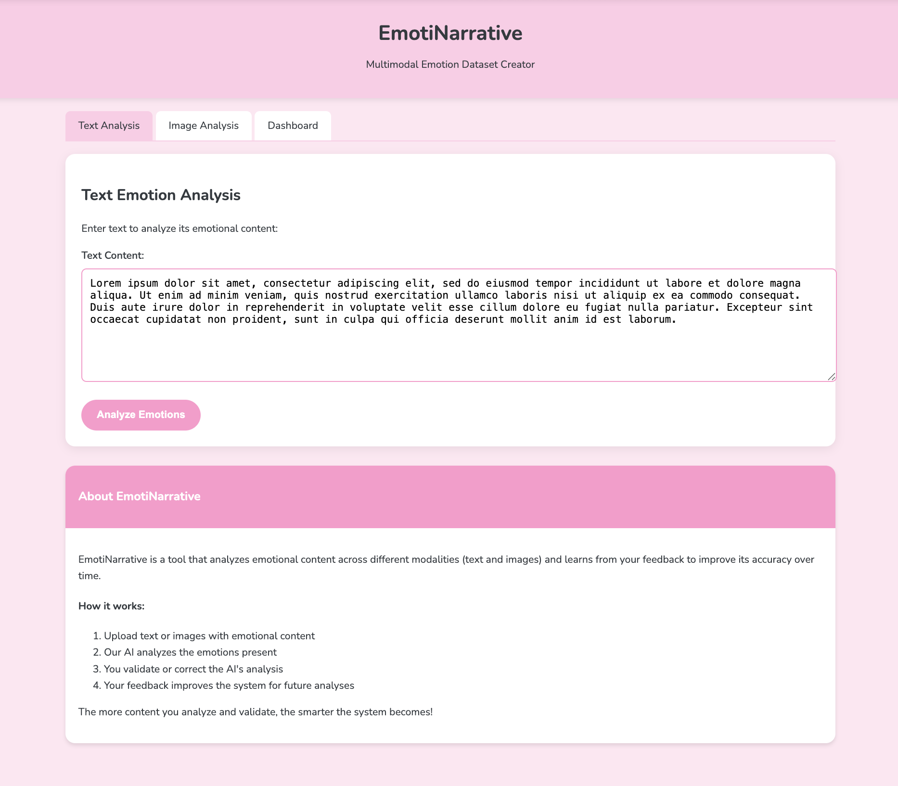

EmotiNarrative
Project for CMU 10335: Art & Machine Learning, Spring 2025



```
EmotiNarrative/
├── app/
│   ├── static/
│   │   ├── css/
│   │   │   └── style.css
│   │   ├── js/
│   │   │   └── script.js
│   │   └── uploads/
│   ├── templates/
│   │   ├── index.html
│   │   ├── validate.html
│   │   └── dashboard.html
│   ├── models/
│   │   ├── text_emotion_model.py
│   │   └── image_emotion_model.py
│   ├── utils/
│   │   ├── db_manager.py
│   │   ├── learning_engine.py
│   │   └── json_utils.py
│   └── app.py
├── data/
│   └── emotion_data.db
├── text_to_emotions.py
├── image_to_emotions.py
├── requirements.txt
└── README.md
```

`text_to_emotions.py` - Analyzes emotions in written text using DistilBERT-base-uncased (https://huggingface.co/bhadresh-savani/distilbert-base-uncased-emotion)

`image_to_emotions.py` - Detects and analyzes emotions in images using DeepFace (https://github.com/serengil/deepface)

`emotion_data.db` in .gitignore